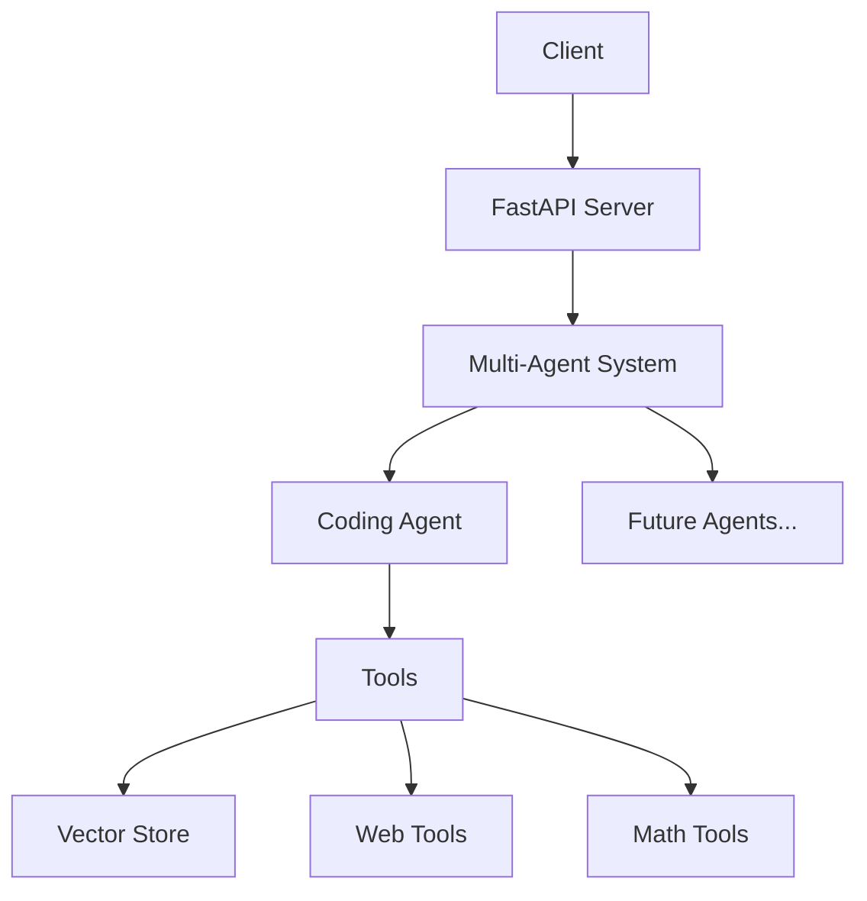

# Multi-Agent Coding System - Product Design & Development Document

## Table of Contents
1. [Product Overview](#1-product-overview)
2. [System Architecture](#2-system-architecture)
3. [Technical Stack](#3-technical-stack)
4. [Agent Capabilities](#4-agent-capabilities)
5. [Tool Development](#5-tool-development)
6. [API Design](#6-api-design)
7. [Data Flow](#7-data-flow)
8. [Security & Performance](#8-security--performance)
9. [Testing Strategy](#9-testing-strategy)
10. [Future Roadmap](#10-future-roadmap)

---

## 1. Product Overview

### 1.1 Description
The Multi-Agent Coding System is an AI-powered coding assistance platform that leverages Google Gemini 1.5 Pro and LangChain to provide intelligent coding support, documentation search, and code generation capabilities.

### 1.2 Core Features
- Advanced code generation
- API documentation search
- Mathematical problem solving
- Vector database integration
- Multi-agent architecture
- Web scraping capabilities

### 1.3 Target Users
- Software developers
- Data scientists
- System architects
- Technical leads
- DevOps engineers

---

## 2. System Architecture

### 2.1 High-Level Architecture


### 2.2 Component Breakdown
1. **FastAPI Server**
   - Entry point for all requests
   - Request validation
   - Response formatting

2. **Multi-Agent System**
   - Request routing
   - Agent coordination
   - Response aggregation

3. **Coding Agent**
   - Code generation
   - Documentation search
   - Mathematical computations

---

## 3. Technical Stack

### 3.1 Core Technologies
- **Backend Framework**: FastAPI
- **AI Model**: Google Gemini 1.5 Pro
- **Agent Framework**: LangChain
- **Vector Store**: FAISS
- **Documentation**: Markdown

### 3.2 Dependencies
```python
langchain>=0.1.0
fastapi>=0.100.0
google-generativeai>=0.3.0
faiss-cpu>=1.7.4
pydantic>=2.0.0
```

---

## 4. Agent Capabilities

### 4.1 Current Tools (7 Implemented)
1. **alegbra**
   ```python
   @tool 
   async def alegbra(*args: str) -> str:
       """Solve algebraic equations."""
   ```

2. **solve_math_equations**
   ```python
   @tool
   async def solve_math_equations(equation: str) -> str:
       """Solve math equations."""
   ```

3. **search_api_docs**
   ```python
   @tool
   async def search_api_docs(query: str) -> str:
       """Search through API documentation."""
   ```

4. **search_web**
   ```python
   @tool
   async def search_web(query: str) -> str:
       """Search the web for coding information."""
   ```

5. **get_query_from_vectordatabase**
   ```python
   @tool 
   async def get_query_from_vectordatabase(query: str) -> str:
       """Vector database similarity search."""
   ```

6. **generate_code**
   ```python
   @tool
   async def generate_code(prompt: str) -> str:
       """Generate code based on requirements."""
   ```

7. **solve_complex_maths_using_it**
   ```python
   Tool(
       name="solve_complex_maths_using_it",
       func=scipy_general_solver,
       description="Solve complex mathematics"
   )
   ```

### 4.2 Future Tools Development
Target: 500+ specialized tools covering:
- Code optimization
- Security analysis
- Performance testing
- Database operations
- DevOps automation
- API integration
- UI/UX generation
- Documentation generation

---

## 5. Tool Development

### 5.1 Tool Creation Template
```python
@tool
async def new_tool(parameters: str) -> str:
    """Tool description."""
    try:
        response = await self.llm.ainvoke([HumanMessage(content=parameters)])
        return response.content
    except Exception as e:
        return f"Error: {str(e)}"
```

### 5.2 Tool Integration Process
1. Define tool function
2. Add documentation
3. Implement error handling
4. Register with agent
5. Add tests
6. Deploy

---

## 6. API Design

### 6.1 Endpoints

#### Query Endpoint
```python
@app.post("/query")
async def process_query(request: QueryRequest):
    """
    Process coding queries through the multi-agent system.
    """
```

#### API Documentation Search
```python
@app.post("/search-api-docs")
async def search_api_docs(request: ApiDocsRequest):
    """
    Search through API documentation.
    """
```

#### Code Extraction
```python
@app.post("/extract-code")
async def extract_code(request: ExtractCodeRequest):
    """
    Extract code examples from URLs.
    """
```

---

## 7. Data Flow

### 7.1 Request Processing
1. Client sends request
2. FastAPI validates request
3. Multi-agent system routes request
4. Appropriate agent processes request
5. Tools execute required operations
6. Response returned to client

### 7.2 Vector Store Integration
```python
@app.on_event("startup")
async def startup_event():
    docs = text_loader("./uploaded_files/main.txt")
    text_splitter = RecursiveCharacterTextSplitter(chunk_size=400, chunk_overlap=80)
    all_splits = text_splitter.split_documents(docs)
    texts = [doc.page_content for doc in all_splits]
    vector_store.add_texts(texts, metadatas=[doc.metadata for doc in all_splits])
```

---

## 8. Security & Performance

### 8.1 Security Measures
- API key management
- Rate limiting
- Input validation
- Error handling
- Secure file uploads

### 8.2 Performance Optimization
- Async operations
- Caching
- Vector store indexing
- Response streaming
- Load balancing

---

## 9. Testing Strategy

### 9.1 Test Types
1. Unit Tests
2. Integration Tests
3. End-to-End Tests
4. Performance Tests

### 9.2 Test Implementation
```python
# test_agent.py
async def test_coding_agent():
    response = await agent.process_request(
        "Create a React hook for API calls"
    )
    assert "response" in response
    assert "thought_process" in response
```

---

## 10. Future Roadmap

### 10.1 Short-term Goals (3 months)
- Implement 50 new tools
- Improve error handling
- Add caching layer
- Enhance documentation

### 10.2 Medium-term Goals (6 months)
- Reach 200 tools
- Add new agent types
- Implement tool chaining
- Add performance monitoring

### 10.3 Long-term Goals (12 months)
- Achieve 500+ tools
- Add collaborative features
- Implement tool marketplace
- Support multiple LLM providers

### 10.4 Tool Categories to Develop
1. Code Analysis Tools
2. Performance Optimization
3. Security Testing
4. Database Operations
5. Cloud Integration
6. UI/UX Generation
7. Documentation Tools
8. Testing Automation
9. DevOps Tools
10. API Integration

---

**Note**: This document is a living document and will be updated as the system evolves and new features are added.